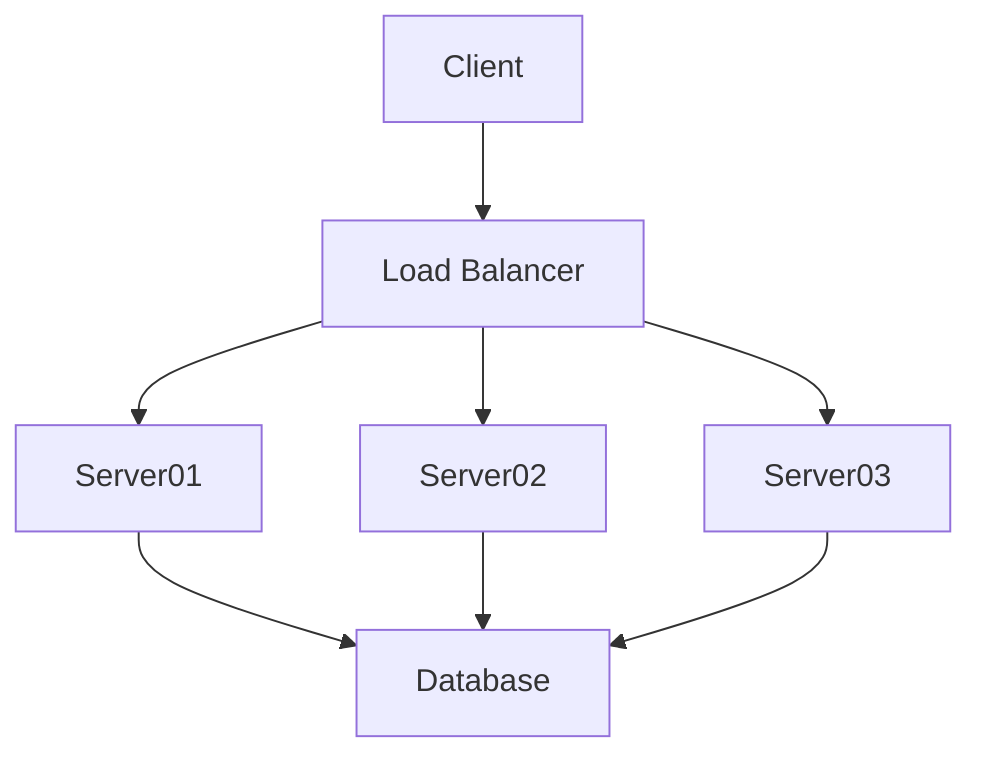
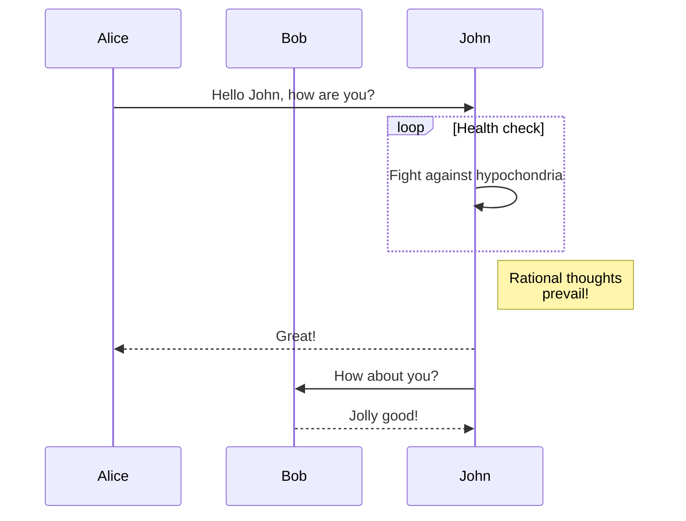

# MDX Features

This tutorial demonstrates the special features available in Docusaurus through MDX (Markdown + JSX). You'll see both the raw code and the rendered result.

## MDX Basics

MDX allows you to use React components directly within your Markdown:

```mdx
# Hello from Markdown!

<div className="custom-container">
  <h2>Hello from JSX!</h2>
</div>
```

The rendered result:

# Hello from Markdown!

<div className="custom-container">
  <h2>Hello from JSX!</h2>
</div>

## Meta Data with Front Matter

Front matter is YAML content at the very beginning of your document that defines metadata. This metadata controls how your page appears in the navigation, search results, and browser tabs:

```yaml
---
sidebar_position: 2            # Controls order in sidebar
title: My Document Title       # Title for the browser tab and sidebar (if no sidebar_label is set)
keywords: [documentation, tutorial, mdx] # For search and SEO (search engine optimization)
tags: [beginner, tutorial]     # For categorization and filtering (optional), appears at the bottom of the page
---
```

## Tabs Component

You can use the Tabs component for content that should be displayed in multiple languages or formats:

````mdx
import Tabs from '@theme/Tabs';
import TabItem from '@theme/TabItem';

<Tabs>
  <TabItem value="apple" label="Apple" default>
    This is an apple 🍎
  </TabItem>
  <TabItem value="orange" label="Orange">
    This is an orange 🍊
  </TabItem>
  <TabItem value="banana" label="Banana">
    This is a banana 🍌
  </TabItem>
</Tabs>

<Tabs groupId="programming-language">
  <TabItem value="python" label="Python">
```python
def hello_world():
    print("Hello, world!")
```
  </TabItem>
  <TabItem value="r" label="R">
```r
hello_world <- function() {
  print("Hello World!")
}
```
  </TabItem>
  <TabItem value="charp" label="C#">
```charp
void HelloWorld() 
{
    Console.WriteLine("Hello, world!");
}
```
  </TabItem>
</Tabs>
````

The rendered result:

import Tabs from '@theme/Tabs';
import TabItem from '@theme/TabItem';

<Tabs>
  <TabItem value="apple" label="Apple" default>
    This is an apple 🍎
  </TabItem>
  <TabItem value="orange" label="Orange">
    This is an orange 🍊
  </TabItem>
  <TabItem value="banana" label="Banana">
    This is a banana 🍌
  </TabItem>
</Tabs>


<Tabs groupId="programming-language">
  <TabItem value="python" label="Python">
```python
def hello_world():
    print("Hello, world!")
```
  </TabItem>
  <TabItem value="r" label="R">
```r
hello_world <- function() {
  print("Hello World!")
}
```
  </TabItem>
  <TabItem value="charp" label="C#">
```charp
void HelloWorld() 
{
    Console.WriteLine("Hello, world!");
}
```
  </TabItem>
</Tabs>


## Cross-Linking to Other Pages

Docusaurus makes it easy to link to other pages in your documentation:

```md
[Link to Getting Started](../getting-started/installation.md)
[Link to Another Example](./markdown-tutorial.mdx)
```

The rendered result:

[Link to Getting Started](../getting-started/installation.md)  
[Link to Another Example](./markdown-tutorial.mdx)

## External Iframe Embedding

You can embed external content using iframes:

```html
<iframe 
  src="https://www.openstreetmap.org/export/embed.html?bbox=-0.004017949104309083%2C51.47612752641776%2C0.00030577182769775396%2C51.478569861898606&layer=mapnik" 
  width="100%" 
  height="400px" 
  style={{border: '1px solid #ddd', borderRadius: '8px'}}
  title="OpenStreetMap"
/>
```

The rendered result:

<iframe 
  src="https://www.openstreetmap.org/export/embed.html?bbox=-0.004017949104309083%2C51.47612752641776%2C0.00030577182769775396%2C51.478569861898606&layer=mapnik" 
  width="100%" 
  height="400px" 
  style={{border: '1px solid #ddd', borderRadius: '8px'}}
  title="OpenStreetMap"
/>


## Mermaid Diagrams

Docusaurus supports [Mermaid](https://mermaid.js.org/) diagrams:

````md




````

The rendered result (if Mermaid is configured in your Docusaurus setup):


## Math Equations

Docusaurus can render math equations using KaTeX:

````md
Inline math: $E = mc^2$

Block math:

$$
\begin{aligned}
\frac{\partial \mathcal{L}}{\partial w} &= \frac{1}{N} \sum_{i=1}^N \frac{\partial \mathcal{L}_i}{\partial w}\\
&= \frac{1}{N} \sum_{i=1}^N \frac{\partial }{\partial w}\left( -y_i \log(\hat{y}_i) - (1-y_i) \log(1-\hat{y}_i) \right)
\end{aligned}
$$

$$
I = \int_0^{2\pi} \sin(x)\,dx
$$
````

The rendered result:

Inline math: $E = mc^2$

Block math:

$$
\begin{aligned}
\frac{\partial \mathcal{L}}{\partial w} &= \frac{1}{N} \sum_{i=1}^N \frac{\partial \mathcal{L}_i}{\partial w}\\
&= \frac{1}{N} \sum_{i=1}^N \frac{\partial }{\partial w}\left( -y_i \log(\hat{y}_i) - (1-y_i) \log(1-\hat{y}_i) \right)
\end{aligned}
$$

$$
I = \int_0^{2\pi} \sin(x)\,dx
$$


## Custom CSS in MDX

You can use inline styles or import CSS modules:

```mdx
<div style={{
  backgroundColor: 'violet',
  padding: '20px',
  borderRadius: '8px',
  marginBottom: '1rem'
}}>
  This div has a custom style applied directly in the MDX file.
</div>
```

The rendered result:

<div style={{
  backgroundColor: 'violet',
  padding: '20px',
  borderRadius: '8px',
  marginBottom: '1rem'
}}>
  This div has a custom style applied directly in the MDX file.
</div>


## Admonitions (Callouts)

Docusaurus provides special callout components:

```md
:::note
This is a note admonition.
:::

:::tip
This is a tip admonition with a title.
:::

:::info Title
This is an info admonition with a custom title.
:::

:::caution
This is a caution admonition.
:::

:::danger
This is a danger admonition.
:::
```

The rendered result:

:::note
This is a note admonition.
:::

:::tip
This is a tip admonition with a title.
:::

:::info Title
This is an info admonition with a custom title.
:::

:::caution
This is a caution admonition.
:::

:::danger
This is a danger admonition.
:::

## Collapsible Admonitions

You can make any admonition collapsible:

````md
:::note{collapsible=true}
This is a collapsible note admonition.

- You can add complex content here
- Including lists, code blocks, etc.

```jsx
function Example() {
  return <div>This is a code block inside a collapsible admonition</div>;
}
```
:::

:::tip{collapsible=true}
This is a collapsible tip admonition.
:::

:::info{collapsible=true open=false}
This collapsible info admonition starts closed.
:::

:::warning{collapsible=true}
This is a collapsible warning admonition.
:::

:::danger{collapsible=true open=false}

This is a collapsible danger admonition that starts closed.

:::

:::tip{collapsible=true title="Best Practices" icon="💡"}
## Using PetroVisor Effectively

Follow these best practices:

1. Use consistent naming conventions
2. Document your code thoroughly
3. Build modular components

```python
# Example of good practice
def calculate_average(values):
    """Calculate the average of a list of values.
    
    Args:
        values (list): A list of numerical values
        
    Returns:
        float: The average value
    """
    return sum(values) / len(values)
```
:::

:::info{collapsible=true open=false title="API Documentation" icon="📚"}
The complete API documentation can be found here.

```typescript
interface Config {
  endpoint: string;
  timeout?: number;
  retries?: number;
}
```
:::
````

The rendered result:

:::note{collapsible=true}
This is a collapsible note admonition.

- You can add complex content here
- Including lists, code blocks, etc.

```jsx
function Example() {
  return <div>This is a code block inside a collapsible admonition</div>;
}
```
:::

:::tip{collapsible=true}
This is a collapsible tip admonition.
:::

:::info{collapsible=true open=false}
This collapsible info admonition starts closed.
:::

:::warning{collapsible=true}
This is a collapsible warning admonition.
:::

:::danger{collapsible=true open=false}
This is a collapsible danger admonition that starts closed.
:::

:::tip{collapsible=true title="Best Practices" icon="💡"}
## Using PetroVisor Effectively

Follow these best practices:

1. Use consistent naming conventions
2. Document your code thoroughly
3. Build modular components

```python
# Example of good practice
def calculate_average(values):
    """Calculate the average of a list of values.
    
    Args:
        values (list): A list of numerical values
        
    Returns:
        float: The average value
    """
    return sum(values) / len(values)
```
:::

:::info{collapsible=true open=false title="API Documentation" icon="📚"}
The complete API documentation can be found here.

```typescript
interface Config {
  endpoint: string;
  timeout?: number;
  retries?: number;
}
```
:::

## Custom Admonitions

In addition to the standard admonitions, you can use our custom admonitions:

````mdx

:::function{collapsible}
**`create_entity(entity_type, name, properties=None)`**

Creates a new entity in the PetroVisor platform.

**Parameters:**
- `entity_type` (str): The type of entity to create
- `name` (str): The name of the entity
- `properties` (dict, optional): Additional properties for the entity

**Returns:**
- str: The ID of the newly created entity

**Examples:**
```python
# Create a well entity
well_id = client.create_entity('Well', 'Well-001', {
    'latitude': 42.123,
    'longitude': -71.456,
    'depth': 9500
})
```

:::

:::class{collapsible}
**`SignalProcessor`**

A class for processing and analyzing signal data.

**Initialization:**
```python
processor = SignalProcessor(signal_name, time_interval='1d')
```

**Properties:**
- `signal_name` (str): The name of the signal being processed
- `time_interval` (str): The time interval for aggregation

**Methods:**
- `resample(interval)`: Resamples the signal data to a new interval
- `interpolate(method='linear')`: Interpolates missing values
- `filter(expression)`: Filters data based on expression
- `aggregate(function)`: Aggregates data using the specified function
:::
````

The rendered result:

:::function{collapsible}
**`create_entity(entity_type, name, properties=None)`**

Creates a new entity in the PetroVisor platform.

**Parameters:**
- `entity_type` (str): The type of entity to create
- `name` (str): The name of the entity
- `properties` (dict, optional): Additional properties for the entity

**Returns:**
- str: The ID of the newly created entity

**Examples:**
```python
# Create a well entity
well_id = client.create_entity('Well', 'Well-001', {
    'latitude': 42.123,
    'longitude': -71.456,
    'depth': 9500
})
```
:::

:::class{collapsible}
**`SignalProcessor`**

A class for processing and analyzing signal data.

**Initialization:**
```python
processor = SignalProcessor(signal_name, time_interval='1d')
```

**Properties:**
- `signal_name` (str): The name of the signal being processed
- `time_interval` (str): The time interval for aggregation

**Methods:**
- `resample(interval)`: Resamples the signal data to a new interval
- `interpolate(method='linear')`: Interpolates missing values
- `filter(expression)`: Filters data based on expression
- `aggregate(function)`: Aggregates data using the specified function
:::


## Further Resources

- [Docusaurus MDX Documentation](https://docusaurus.io/docs/markdown-features/react)
- [MDX Official Documentation](https://mdxjs.com/)
- [Mermaid Diagram Syntax](https://mermaid.js.org/intro/syntax-reference.html)
- [KaTeX Documentation](https://katex.org/docs/supported.html)
- [Tabs Component Documentation](https://docusaurus.io/docs/markdown-features/tabs)
- [Docusaurus Admonitions](https://docusaurus.io/docs/markdown-features/admonitions)
- [Docusaurus Create a doc](https://docusaurus.io/docs/create-doc)